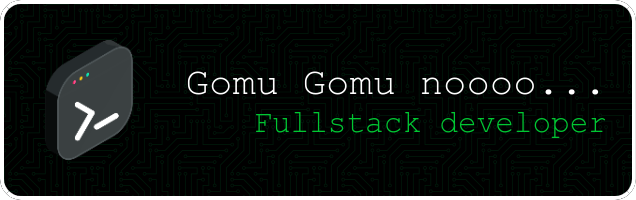

<div align="center">

[](#français) [](#english)

</div>

---

<div align="center">

[](https://github.com/i2sac) [](https://www.linkedin.com/in/louis-issac-jean-samba-diouf) [](https://instagram.com/louisisaacpeterson) [](mailto:louisisaacdf@gmail.com)


</div>

---

# <div id="français"></div>

<details open>
<summary><h2>🇫🇷 Version Française</h2></summary>

### 💫 À propos de moi

Je suis **Louis Issac Jean Samba Diouf** ([@i2sac](https://github.com/i2sac)), développeur Full-Stack Junior passionné par l'innovation technologique. Je conjugue expertise technique en **Go, Rust et JavaScript** avec une sensibilité design affirmée. Mon parcours allie développement backend performant, game development et création d'interfaces utilisateur intuitives.

#### 🎓 Formation & Parcours

**Diplômé** en Management Informatisé des Organisations et avec un **Master 1 en Intelligence Artificielle et Ingénierie des Données** (Université Iba Der Thiam de Thiès, 2020-2022), j'ai forgé mes compétences à travers des expériences en marketing digital, développement web freelance et formation intensive à **Zone01 Dakar**.

#### 🎯 Expertise Technique

**Mon expertise** couvre un large éventail de technologies modernes :

- **🦀 Backend Performant** : Go, Rust pour des applications sécurisées, concurrentes et à haute performance (TCP/IP, WebSocket, API RESTful, GraphQL)
- **🌐 Frontend Moderne** : JavaScript, HTML5, CSS3, Tailwind CSS, D3.js, ECharts pour des interfaces réactives et élégantes
- **🎮 Game Development** : Bevy, SDL2, Rapier3D, moteurs de jeu custom, physique 2D/3D, génération procédurale
- **🎨 Design & Créativité** : Figma, Adobe XD, Photoshop, Illustrator pour des expériences UX/UI sur-mesure
- **🔧 DevOps & Tools** : Docker, Git, Coolify, Vercel, PostgreSQL, SQLite
- **🤖 Data Science** : Machine Learning, Deep Learning, Python, R, Data Analytics
- **🛒 E-commerce** : WordPress, WooCommerce - développement et gestion de sites (+10 projets)

#### 🏢 Expérience Professionnelle

- **🎓 Développement Full-Stack Junior** - Zone01 Dakar (2025 - 2 ans)
- **💻 Développeur Freelance Web & Infographie** - AFRICANTINE, Dakar (2023 - 1 an 9 mois)
- **📊 Assistant Webmaster** (Marketing Digital & Analytique) - SOBOA, Dakar (2022 - 2 ans 6 mois)
- **📞 Téléconseiller** - INTELCIA, Thiès (2020 - 7 mois)

> "De la conception UX/UI à la mise en production, j'orchestre la chaîne complète pour livrer des expériences performantes et accessibles." 🚀

---

### 🛠️ Stack Technique

<div align="center">

#### Langages de Programmation
  
  
  
  
  
  
  

#### Frameworks & Libraries
  
  
  
  
  

#### Bases de Données & DevOps
  
  

#### Design & Créativité
  
  
  
  
  

</div>

---

### 🎯 Projets & Réalisations

#### 💻 Développement Backend & Architecture
- **NetCat** - Serveur de chat TCP temps réel pour 10 utilisateurs avec goroutines, broadcasting intelligent et persistance JSON
- **Forum** - Plateforme communautaire avec architecture MVC, authentification sécurisée, système CRUD et API RESTful containerisée
- **Real-Time Forum** - Forum temps réel avec WebSocket, messagerie instantanée, indicateur de saisie et statut en ligne/hors ligne
- **Push-Swap** - Algorithme de tri optimal avec deux piles, implémentation Turk avec calcul de coût minimal (700-900 opérations pour 100 nombres)

#### 🎮 Game Development
- **Multiplayer FPS** - Jeu de tir 3D avec architecture client-serveur UDP, moteur Bevy, physique Rapier3D et génération procédurale de labyrinthes
- **Smart Road** - Simulation de trafic routier avec IA de gestion de carrefour, détection de collisions et optimisation des flux en temps réel
- **Bomberman DOM** - Jeu multijoueur temps réel (2-4 joueurs) avec mini-framework JS personnalisé, backend Go WebSocket et génération procédurale de maps
- **Anachronos** - Jeu de plateforme 2D avec voyage temporel, physique réaliste, génération procédurale multi-époques et animations 60 FPS
- **Filler** - IA de stratégie pour jeu compétitif, algorithmes de convolution, calcul parallélisé avec Rayon (< 5ms par tour)

#### 🌐 Développement Web Full-Stack
- **GraphQL Dashboard Zone01** - Tableau de bord interactif avec visualisations D3.js/ECharts, authentification JWT et requêtes GraphQL optimisées
- **Mini Framework** - Framework JavaScript from scratch, architecture component-based, state management réactif et virtual DOM léger
- **Landing Page DevOps 01Talent** - Plateforme de mise en avant de talents DevOps (01Talent France)

#### 💼 Projets WordPress E-commerce (+10 sites)
- **Senegrill** - Site e-commerce restaurant sénégalais (USA) avec catalogue et paiement intégré
- **Live Love Baking** - E-commerce pâtisserie avec gestion de commandes en ligne
- **Yvress Boutique** - Boutique mode avec gestion d'inventaire et filtres avancés
- **BellaShop 221** - E-commerce cosmétiques avec système de recommandation
- **S2 Baking Tools** - Outils de pâtisserie professionnelle avec comparateur
- **Najaar** - Site institutionnel avec système de donations et blog multilingue
- **TPM RH Consulting** - Site professionnel RH avec espace client et booking

#### 🎨 Design UX/UI
- **Refonte SamaRH** (Auchan Retail Sénégal) - Plateforme RH
- **Refonte Senegrill** - Site de restaurant sénégalais
- **Dashboard Talent Zone01** - Visualisation des performances étudiantes
- **Forum Zone01** - Réseau social des talents
- **Refonte ISDD** - Site institutionnel d'établissement

---

### 🚀 En Ce Moment

```typescript
const currentFocus = {
  position: "Développement Full-Stack Junior - Zone01 Dakar",
  stack: ["Go", "Rust", "JavaScript", "HTML/CSS"],
  focus: ["Backend Architecture", "Game Development", "UX/UI Design"],
  experience: "+7 ans",
  availability: "Ouvert aux opportunités"
};
```

---

### 💼 Compétences Clés

<div align="center">

| Domaine | Compétences |
|---------|------------|
| **Backend** | Go, Rust, Node.js, Fiber, TCP/IP, WebSocket, API RESTful, GraphQL |
| **Frontend** | JavaScript, HTML5, CSS3, Tailwind CSS, D3.js, ECharts, Canvas API, SPA |
| **Database** | PostgreSQL, SQLite, MySQL |
| **DevOps** | Docker, Git, Coolify, Vercel, VSCode, Postman |
| **Game Dev** | Bevy, SDL2, Rapier3D, Game Design, Multiplayer, Physique 2D/3D |
| **AI/ML** | Python, R, Deep Learning, Machine Learning, Data Analytics |
| **Design** | Figma, Adobe Suite (XD, Photoshop, Illustrator), Canva, UX/UI |
| **CMS** | WordPress, WooCommerce (+10 projets e-commerce) |
| **Soft Skills** | Créativité, Communication, Discipline, Gestion de Projet, Adaptabilité |

</div>

---

### 📊 Statistiques GitHub

<div align="center">
  
  
  
  
</div>

---

### 🎖️ Accomplissements & Certifications

<div align="center">

| 🏅 Réalisation | 📅 Année | 🔗 Description |
|---------------|----------|----------------|
| **Zone01 Dakar - Full-Stack Junior** | 2025 | 2 ans de formation intensive peer-to-peer |
| **Master 1 IA & Ingénierie des Données** | 2020-2022 | Université Iba Der Thiam de Thiès |
| **Licence Management Informatisé** | 2016-2019 | Université Iba Der Thiam de Thiès |
| **Data Science & Analytics** | 2022 | Certifications Udemy & LinkedIn Learning |
| **+10 Sites E-commerce WordPress** | 2023-2025 | Projets clients internationaux |
| **+15 Projets Techniques Go/Rust** | 2024-2025 | Game dev, networking, algorithms |

</div>

---

### 💡 Code Snippet du Moment

```rust
// Serveur TCP haute performance avec Tokio
use tokio::net::TcpListener;
use tokio::io::{AsyncReadExt, AsyncWriteExt};

#[tokio::main]
async fn main() -> Result<(), Box<dyn std::error::Error>> {
    let listener = TcpListener::bind("127.0.0.1:8080").await?;
    println!("🚀 Server running on port 8080");
    
    loop {
        let (mut socket, addr) = listener.accept().await?;
        println!("✅ New connection from: {}", addr);
        
        tokio::spawn(async move {
            let mut buffer = [0; 1024];
            match socket.read(&mut buffer).await {
                Ok(n) if n > 0 => {
                    socket.write_all(&buffer[..n]).await.ok();
                }
                _ => println!("❌ Connection closed"),
            }
        });
    }
}
```

<div align="center">

**💻 Stack principale** : Go 🐹 | Rust 🦀 | JavaScript ⚡ | HTML/CSS 🎨

**🎯 +7 ans d'expérience** | **� +25 projets** | **🌍 Clients internationaux**

</div>

---

### 📈 Graphique de Contribution

<div align="center">
  
</div>

---

### ✍️ Citation Dev du Jour

<div align="center">
  
</div>

---

### 🎯 Vision & Objectifs

- **💡 Innovation Technologique** : Développer des solutions numériques qui résolvent des problèmes réels
- **📚 Excellence Technique** : Maîtriser continuellement les technologies émergentes
- **🌍 Impact Social** : Contribuer à l'écosystème tech africain
- **🤝 Collaboration Open Source** : Partager mes créations avec la communauté mondiale

---

### 📫 Contact & Collaboration

**💼 Email Professionnel :** [louisisaacdf@gmail.com](mailto:louisisaacdf@gmail.com)

Je suis ouvert aux opportunités de collaboration, discussions techniques et échanges sur des projets innovants :

- 💼 **Opportunités professionnelles** et missions freelance
- 🤝 **Collaborations** sur des projets open source
- 💡 **Échanges techniques** et partage de connaissances
- 🌍 **Initiatives d'innovation** en Afrique

---

<div align="center">

*"Le code est un art, le design est une science, et l'innovation est notre mission."* 🚀✨

**Merci de visiter mon profil !** ⭐

</div>

</details>

---

# <div id="english"></div>

<details>
<summary><h2>🇬🇧 English Version</h2></summary>

### 💫 About Me

I'm **Louis Issac Jean Samba Diouf** ([@i2sac](https://github.com/i2sac)), a Junior Full-Stack Developer passionate about technological innovation. I combine technical expertise in **Go, Rust, and JavaScript** with a strong design sensibility. My journey combines high-performance backend development, game development, and intuitive user interface creation.

#### 🎓 Education & Background

**Graduate** in Computerized Management of Organizations with a **Master 1 in Artificial Intelligence and Data Engineering** (Iba Der Thiam University of Thiès, 2020-2022), I've honed my skills through experiences in digital marketing, freelance web development, and intensive training at **Zone01 Dakar**.

#### 🎯 Technical Expertise

**My expertise** covers a wide range of modern technologies:

- **🦀 High-Performance Backend**: Go, Rust for secure, concurrent, high-performance applications (TCP/IP, WebSocket, RESTful API, GraphQL)
- **🌐 Modern Frontend**: JavaScript, HTML5, CSS3, Tailwind CSS, D3.js, ECharts for reactive and elegant interfaces
- **🎮 Game Development**: Bevy, SDL2, Rapier3D, custom game engines, 2D/3D physics, procedural generation
- **🎨 Design & Creativity**: Figma, Adobe XD, Photoshop, Illustrator for custom UX/UI experiences
- **🔧 DevOps & Tools**: Docker, Git, Coolify, Vercel, PostgreSQL, SQLite
- **🤖 Data Science**: Machine Learning, Deep Learning, Python, R, Data Analytics
- **� E-commerce**: WordPress, WooCommerce - development and management (+10 projects)

#### 🏢 Professional Experience

- **🎓 Junior Full-Stack Developer** - Zone01 Dakar (2025 - 2 years)
- **💻 Freelance Web Developer & Graphic Designer** - AFRICANTINE, Dakar (2023 - 1 year 9 months)
- **📊 Webmaster Assistant** (Digital Marketing & Analytics) - SOBOA, Dakar (2022 - 2 years 6 months)
- **📞 Customer Service Advisor** - INTELCIA, Thiès (2020 - 7 months)

> "From UX/UI design to production deployment, I orchestrate the complete chain to deliver high-performance and accessible experiences." 🚀

---

### 🛠️ Tech Stack

<div align="center">

#### Programming Languages
  
  
  
  
  
  
  

#### Frameworks & Libraries
  
  
  
  
  

#### Databases & DevOps
  
  

#### Design & Creativity
  
  
  
  
  

</div>

---

### 🎯 Projects & Achievements

#### 💻 Backend Development & Architecture
- **NetCat** - Real-time TCP chat server for 10 users with goroutines, intelligent broadcasting and JSON persistence
- **Forum** - Community platform with MVC architecture, secure authentication, CRUD system and containerized RESTful API
- **Real-Time Forum** - Real-time forum with WebSocket, instant messaging, typing indicator and online/offline status
- **Push-Swap** - Optimal sorting algorithm with two stacks, Turk implementation with minimal cost calculation (700-900 operations for 100 numbers)

#### 🎮 Game Development
- **Multiplayer FPS** - 3D shooter with UDP client-server architecture, Bevy engine, Rapier3D physics and procedural maze generation
- **Smart Road** - Traffic simulation with AI junction management, collision detection and real-time flow optimization
- **Bomberman DOM** - Real-time multiplayer game (2-4 players) with custom JS mini-framework, Go WebSocket backend and procedural map generation
- **Anachronos** - 2D platformer with time travel, realistic physics, multi-era procedural generation and 60 FPS animations
- **Filler** - Strategy AI for competitive game, convolution algorithms, Rayon parallel computing (< 5ms per turn)

#### 🌐 Full-Stack Web Development
- **GraphQL Dashboard Zone01** - Interactive dashboard with D3.js/ECharts visualizations, JWT authentication and optimized GraphQL queries
- **Mini Framework** - JavaScript framework from scratch, component-based architecture, reactive state management and lightweight virtual DOM
- **Landing Page DevOps 01Talent** - Talent showcase platform (01Talent France)

#### 💼 WordPress E-commerce Projects (+10 sites)
- **Senegrill** - Senegalese restaurant e-commerce site (USA) with catalog and integrated payment
- **Live Love Baking** - Bakery e-commerce with online order management
- **Yvress Boutique** - Fashion store with inventory management and advanced filters
- **BellaShop 221** - Cosmetics e-commerce with recommendation system
- **S2 Baking Tools** - Professional baking tools with product comparator
- **Najaar** - Institutional site with donation system and multilingual blog
- **TPM RH Consulting** - Professional HR site with client area and booking

#### 🎨 UX/UI Design
- **SamaRH Redesign** (Auchan Retail Senegal) - HR Platform
- **Senegrill Redesign** - Senegalese restaurant site
- **Zone01 Talent Dashboard** - Student performance visualization
- **Zone01 Forum** - Talent social network
- **ISDD Redesign** - Institutional site

---

### 🚀 Currently

```typescript
const currentFocus = {
  position: "Junior Full-Stack Developer - Zone01 Dakar",
  stack: ["Go", "Rust", "JavaScript", "HTML/CSS"],
  focus: ["Backend Architecture", "Game Development", "UX/UI Design"],
  experience: "+7 years",
  availability: "Open to opportunities"
};
```

---

### 💼 Key Skills

<div align="center">

| Domain | Skills |
|--------|--------|
| **Backend** | Go, Rust, Node.js, Fiber, TCP/IP, WebSocket, RESTful API, GraphQL |
| **Frontend** | JavaScript, HTML5, CSS3, Tailwind CSS, D3.js, ECharts, Canvas API, SPA |
| **Database** | PostgreSQL, SQLite, MySQL |
| **DevOps** | Docker, Git, Coolify, Vercel, VSCode, Postman |
| **Game Dev** | Bevy, SDL2, Rapier3D, Game Design, Multiplayer, 2D/3D Physics |
| **AI/ML** | Python, R, Deep Learning, Machine Learning, Data Analytics |
| **Design** | Figma, Adobe Suite (XD, Photoshop, Illustrator), Canva, UX/UI |
| **CMS** | WordPress, WooCommerce (+10 e-commerce projects) |
| **Soft Skills** | Creativity, Communication, Discipline, Project Management, Adaptability |

</div>

---

### 📊 GitHub Statistics

<div align="center">
  
  
  
  
</div>

---

### 🎖️ Achievements & Certifications

<div align="center">

| 🏅 Achievement | 📅 Year | 🔗 Description |
|---------------|---------|----------------|
| **Zone01 Dakar - Junior Full-Stack** | 2025 | 2 years intensive peer-to-peer training |
| **Master 1 AI & Data Engineering** | 2020-2022 | Iba Der Thiam University of Thiès |
| **Bachelor Computerized Management** | 2016-2019 | Iba Der Thiam University of Thiès |
| **Data Science & Analytics** | 2022 | Udemy & LinkedIn Learning Certifications |
| **+10 WordPress E-commerce Sites** | 2023-2025 | International client projects |
| **+15 Go/Rust Technical Projects** | 2024-2025 | Game dev, networking, algorithms |

</div>

---

### 💡 Code Snippet of the Moment

```rust
// High-performance TCP server with Tokio
use tokio::net::TcpListener;
use tokio::io::{AsyncReadExt, AsyncWriteExt};

#[tokio::main]
async fn main() -> Result<(), Box<dyn std::error::Error>> {
    let listener = TcpListener::bind("127.0.0.1:8080").await?;
    println!("🚀 Server running on port 8080");
    
    loop {
        let (mut socket, addr) = listener.accept().await?;
        println!("✅ New connection from: {}", addr);
        
        tokio::spawn(async move {
            let mut buffer = [0; 1024];
            match socket.read(&mut buffer).await {
                Ok(n) if n > 0 => {
                    socket.write_all(&buffer[..n]).await.ok();
                }
                _ => println!("❌ Connection closed"),
            }
        });
    }
}
```

<div align="center">

**💻 Main stack**: Go 🐹 | Rust 🦀 | JavaScript ⚡ | HTML/CSS 🎨

**🎯 +7 years experience** | **📊 +25 projects** | **🌍 International clients**

</div>

---

### 📈 Contribution Graph

<div align="center">
  
</div>

---

### ✍️ Dev Quote of the Day

<div align="center">
  
</div>

---

### 🎯 Vision & Goals

- **💡 Technological Innovation**: Develop digital solutions that solve real problems
- **📚 Technical Excellence**: Continuously master emerging technologies
- **🌍 Social Impact**: Contribute to the African tech ecosystem
- **🤝 Open Source Collaboration**: Share my creations with the global community

---

### 📫 Contact & Collaboration

**💼 Professional Email:** [louisisaacdf@gmail.com](mailto:louisisaacdf@gmail.com)

I'm open to collaboration opportunities, technical discussions and exchanges on innovative projects:

- 💼 **Professional opportunities** and freelance missions
- 🤝 **Collaborations** on open source projects
- 💡 **Technical exchanges** and knowledge sharing
- 🌍 **Innovation initiatives** in Africa

---

<div align="center">

*"Code is an art, design is a science, and innovation is our mission."* 🚀✨

**Thank you for visiting my profile!** ⭐

</div>

</details>
